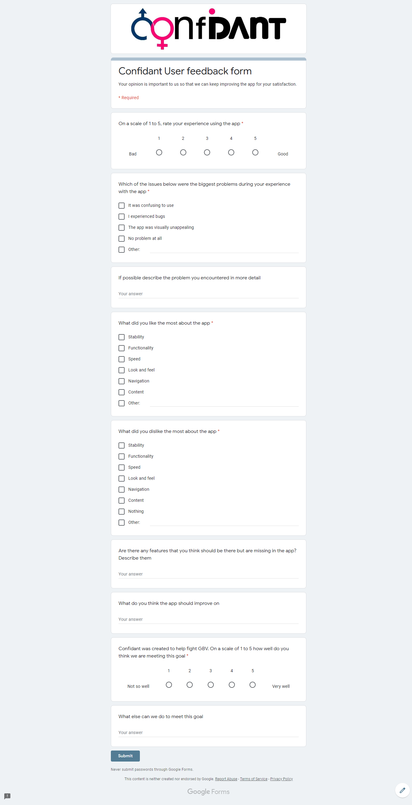
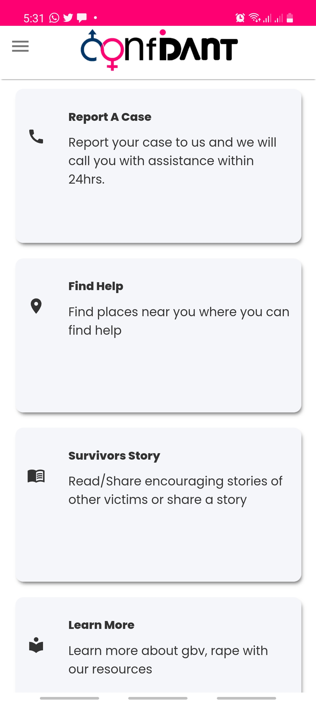
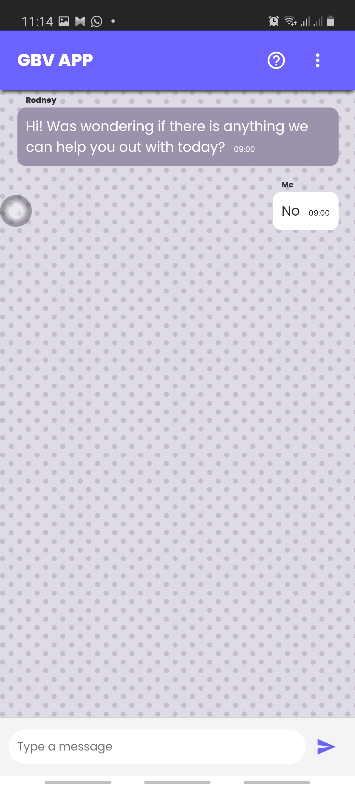

# Confidant


# Description 

Confidant is a Web based platform developed to fight GBV. The platform was developed after noticing an increase in the number of gender based violence cases in the country due to the imposed lockdown as those people who were in abusive relationships are now spending more time with their abusers.

It allows users to

1. Report GBV cases
2. Find details of where they can get GBV related help.
3. Read GBV victims’ stories or share their own GBV stories
4. Learn about GBV and other types of violence.
5. Look at the Zimbabwean and worldwide GBV statistics.
6. Go through an assessment that will determine if they are at risk of GBV. 

# How to use it
To use the app users can visit [https://confidant-zw.web.app here](https://confidant-zw.web.app/)

# About the project 
The project was created using the following technologies

## React js
Frontend was built using reactjs

## Firebase
The app is hosted on Firebase and also uses Firebase firestore as db

## CSS
All styling was done using CSS

# Project setup 

1. Clone the project to your local repo
- to do this you can open your terminal and then type 
```
$ git clone https://github.com/DSCHITgbvapp/fightgbv
```
this clones the repo

2. ```cd``` into the new folder and type
``` $ npm install```
This installs the required dependencies

3. To run the project run 
 ```$ npm start```
This will open up the project in your browser on localhost:3000
We describe how to run the project

# Testing

- We visited the police and had an officer go through it.
- Visited and also sent to organizations that deal with GBV like Musasa for them to try out
- Asked random strangers to test it out
- Created a google form for all these people to report feedback anonymously


# Feedback & action
- We implemented icons instead of illustrations and got rid of the purple theme after user feedback 

image of the app before the feedback

image of the app after the feedback

- Removed the chat feature advice from someone who works for an NGO that focuses on GBV, saying why would someone use our chat feature instead of going straight to Musasa's whatsapp number 

images of the app before the feedback

